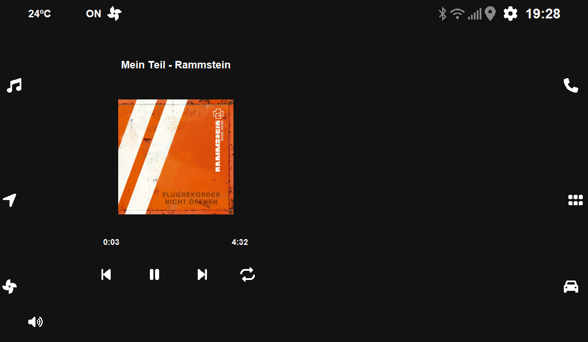

# CarMedia

This is a project to learn more Java andd in the process to make a simple media interface for older car, in this case a VW Golf mk4.

## Functionalities

- Play mp3 files
- Show current time
- Can choose to play local media or Online radio

## Todo

- Get some video from a camera
- Change dark mode to light mode
- Get System Information
- Use pi4J library to use some sensors
- much more

## Screenshots

